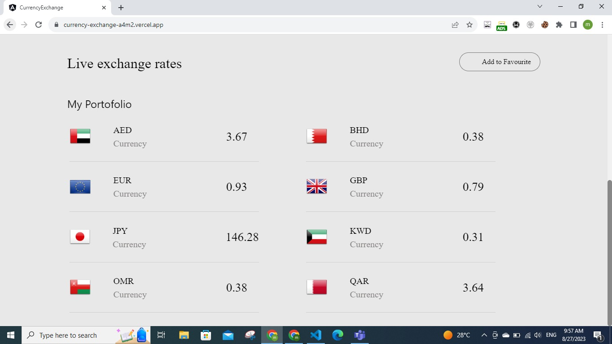
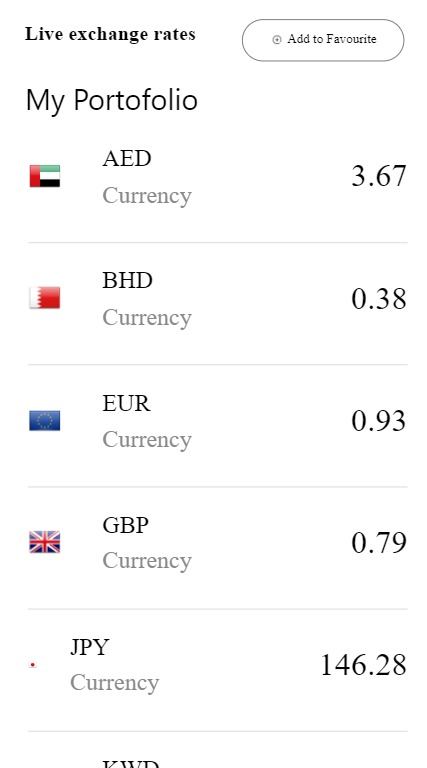

# CurrencyExchange

Welcome to the Currency Conversion Exchange Website project! This web application allows users to convert currencies from one to another and also compare the values of equivalent currencies. The project is built using Angular, TypeScript, Sass, and Tailwind CSS.

## Visit our currency conversion web page :
[https://currency-exchange.app](https://currency-exchange-uy3o.vercel.app/)

## Features

- **Currency Conversion:** Users can convert currencies from one type to another using real-time exchange rates.
- **Currency Comparison:** Users can compare the values of two equivalent currencies.
- **users can select their favourire currencies, add them to thier protoflio and they are updated continously.
- **Responsive Design:** The website is designed to work seamlessly on various devices, from desktop to mobile.

## Technologies Used

- Angular
- TypeScript
- Sass
- Tailwind CSS

# screenshoots
## Currency Conversion

## currency Comparison

## favouraate 

## responsive design

- we worked on the design making it responsive that can fit all devices
 

 

